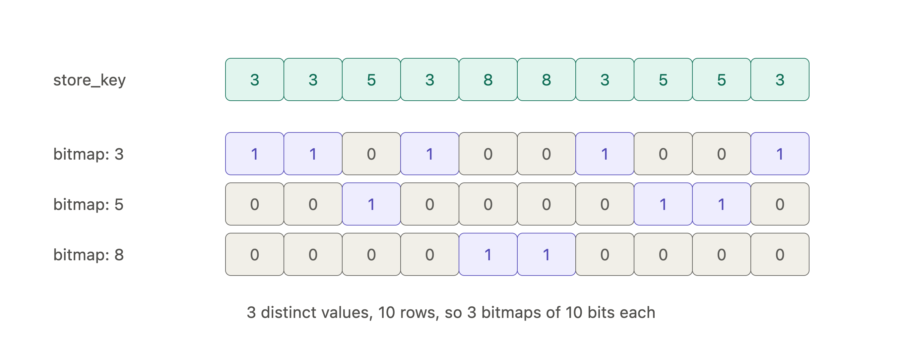

* Data is stored by columns as opposed to rows stored right next to each in disk storage storage.

#### Column Compression
* The nice thing about column-oriented storage is that values within a column are usually very similar or of the same type. This allows us to encode the data and make it smaller.
	* Examples of encodings:
		* Bitmap encoding: Its essentially a table with key and a value. The key is the actual value of the column, the value are just bits representing true or false.
        True, means that this key is the value for that row.
       
        **Example of bitmap encoding**
        

		* Run-length encoding: After a columns values are sorted, similar values will be right next to each other. This allows them to
        be represented in a short hand for.
        **Example of RLE**
        
* **Sort Order in Column Storage**: Allows encodings to be more efficient and smaller since similar values are right next to each other.
