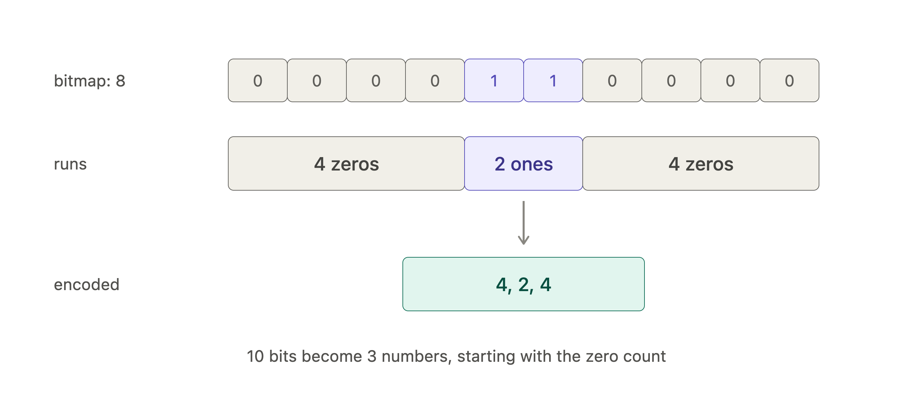

* Data is stored by columns as opposed to rows stored right next to each in disk storage storage.

#### Column Compression
* The nice thing about column-oriented storage is that values within a column are usually very similar or of the same type. This allows us to encode the data and make it smaller.
	* Examples of encodings:
		* Bitmap encoding
        **Example of bitmap encoding**
        
		* Run-length encoding
        **Example of RLE**
        
* **Sort Order in Column Storage**: Allows encodings to be more efficient and smaller since similar values are right next to each other.
