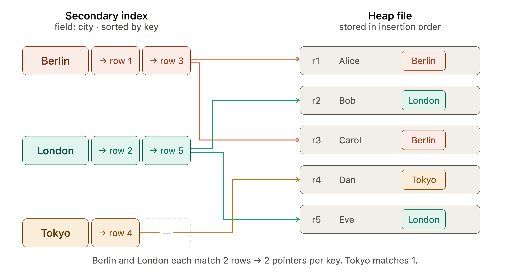
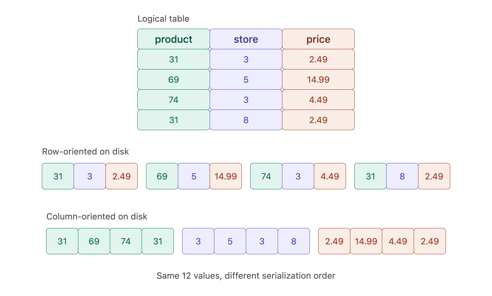
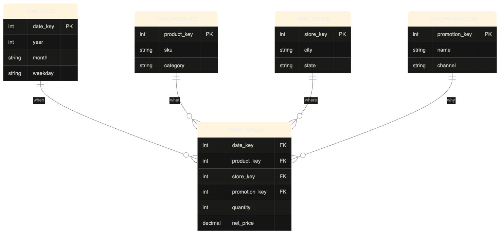

[[Indexes]]
* **Heap file**( #disk_memory ) : location where the data is actually stored and is referenced by the key index.

Example of Non-clustered (Pointer to Heap file)
```
Query: "give me the record where id = 42"
        ↓
  Key-Value Index
  key=42 → value=byte_offset(1234)
        ↓
  Follow pointer to byte 1234 in heap file
        ↓
  Actual data: {id:42, name:"Managua", population:1.4m}
```

* **Clustered Index**: The value of the key-value pair index is the actual data. ([[Indexes#^clustered-index]])
* **Covering Index / Index with included columns**: Compromise between clustered and nonclustered index. It stores some o the tables columns within the index. [[Indexes#^covering-index]]




**Multi-column index**:

**Multi-dimensional index**:

**Automaton**:

**In-memory Database**s:
* Storage is in RAM
* e.g., Redis

**Anti-caching Approach**:

**Non-volatile Memory (NVM)**: 

**Online Transaction Processing (OLTP)**: read and writes small number of records. Data represents latest state of data (current point in time). 
* The term comes from the early days where databases were used to process commercial transactions such as sales, products, blog posts.

**Online Analytic Processing (OLAP)**: Read and writes large amounts of data, usually with the purpose of providing business intelligence and help support/make business decisions
* OLAP usually deals with aggregations and analytics on OLTP data. They help answer questions like "what was our total revenue last year from selling XYZ?".

**Data Warehouse**: nowadays big companies use different databases for different purposes. One for OLTP transactions and another for OLAP (analytics) processes. 
* Data warehouses usually have more compute power and usually have [[Column-Oriented Storage]]. 

**Example of column-oriented storage v.s. row-oriented**


* Data modeling in data warehouses are usually based off of the **star schema/dimensional modeling** and the **snowflake schema**
	* **Star schema**: Made up of fact tables and dimension tables. **Fact tables** are tables whose rows represent an event/transaction that happened. **Dimension tables** on the other hand are tables the contain metadata/descriptive data on those events in the  fact tables. Dimension tables answer the who/what/where/when of events.
    * **Snowflake schema**: more or less the same as a star schema just that the dimension tables have sub-dimension tables.

**Example of star schema model**



**Vectorized processing**: It's just taking a chunk of data in a column-oriented database, and passing it to the CPU to perform opertions on that data in parallel

**Column families**: Essentially data is stored row-oriented and this term is very misleading. They store all columns from a row together, along with a row key, and they do not use column compression.  It is mostly row-oriented.
