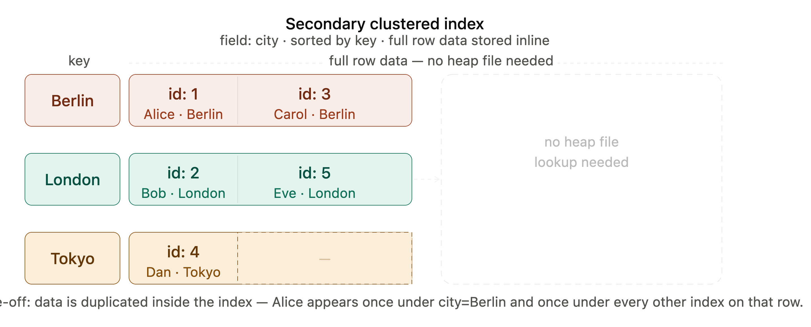

[[Indexes]]
* **Heap file**( #disk_memory ) : location where the data is actually stored and is referenced by the key index.

Example of Non-clustered (Pointer to Heap file)
```
Query: "give me the record where id = 42"
        ↓
  Key-Value Index
  key=42 → value=byte_offset(1234)
        ↓
  Follow pointer to byte 1234 in heap file
        ↓
  Actual data: {id:42, name:"Managua", population:1.4m}
```

* **Clustered Index**: The value of the key-value pair index is the actual data. ([[Indexes#^clustered-index]])
* **Covering Index / Index with included columns**: Compromise between clustered and nonclustered index. It stores some o the tables columns within the index. [[Indexes#^covering-index]]




**Multi-column index**:

**Multi-dimensional index**:

**Automaton**:

**In-memory Database**s:
* Storage is in RAM
* e.g., Redis

**Anti-caching Approach**:

**Non-volatile Memory (NVM)**: 

**Online Transaction Processing (OLTP)**: 

**Online Analytic Processing (OLAP)**:


